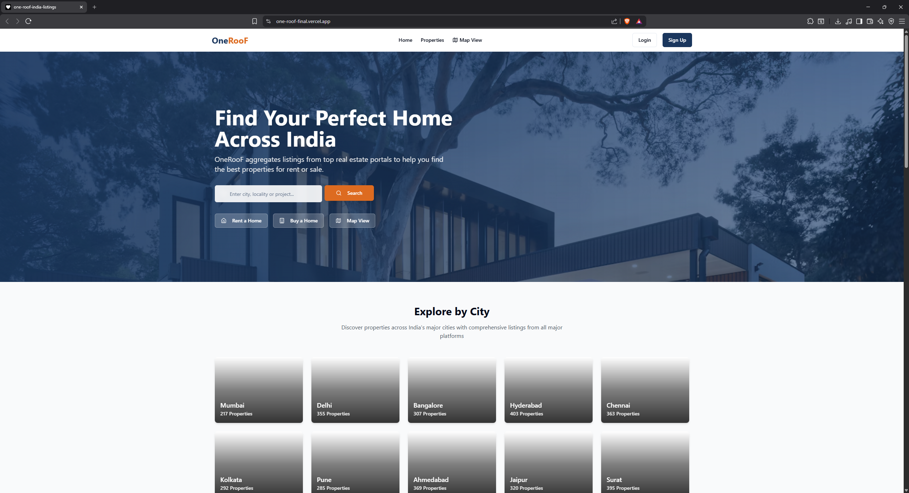
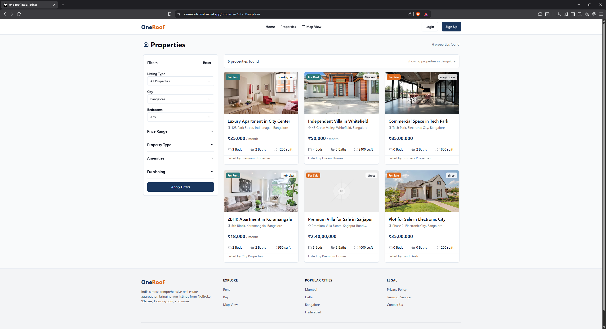
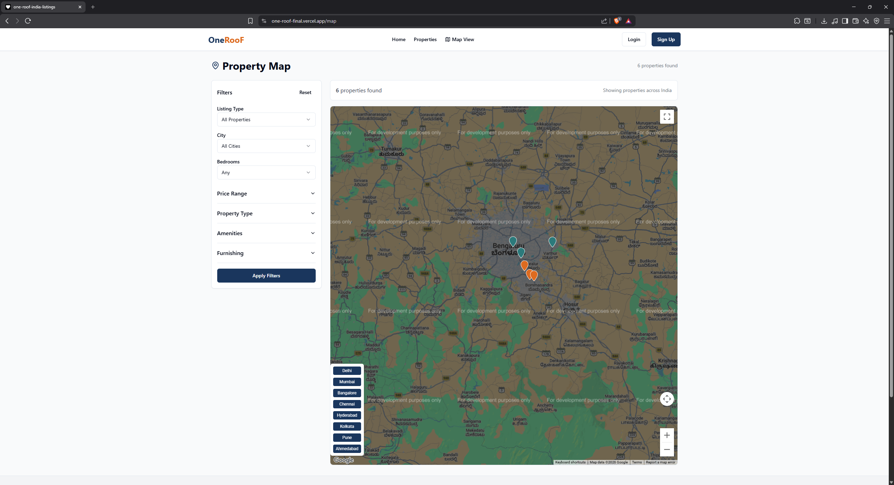

# OneRoof Real Estate Aggregator

## Overview

OneRoof is a modern real estate aggregation platform that helps users discover, browse, and explore property listings through a single unified interface.

The platform provides property search, property details, and location-based exploration features through a responsive and user-friendly web application.

---

## Features

* Property Search and Filtering
* Property Listing Management
* Property Detail Pages
* Interactive Property Map
* Responsive User Interface
* Mobile-Friendly Design
* Cloud Database Integration
* Modern Dashboard Experience

---

## Technologies Used

### Frontend

* React
* TypeScript
* Vite
* Tailwind CSS
* shadcn/ui

### Backend & Database

* Supabase

### Deployment

* Vercel

---

## Live Website

https://one-roof-final.vercel.app/

---

## Dashboard Preview



---

## Property Listings



---

## Property Map



---

## Project Structure

```text
src/
public/
supabase/
```

---

## Key Highlights

* Developed a real estate aggregation platform using React and TypeScript.
* Implemented property browsing and search functionality.
* Integrated Supabase for backend and database services.
* Designed responsive user interfaces using Tailwind CSS.
* Built an intuitive property discovery experience.
* Optimized the platform for desktop and mobile devices.

---

## Future Enhancements

* Advanced Property Filters
* AI-Based Property Recommendations
* Property Comparison Tools
* User Authentication
* Saved Properties and Favorites
* Real-Time Property Updates

---

## Project Files

* Source Code
* Project Report
* Dashboard Screenshots
* Property Listing Screenshots
* Interactive Map Interface
* Deployment Link

---

## Author

Samarth Ravi Y

B.Tech Computer Science Engineering (IoT)

Jain (Deemed-to-be) University
